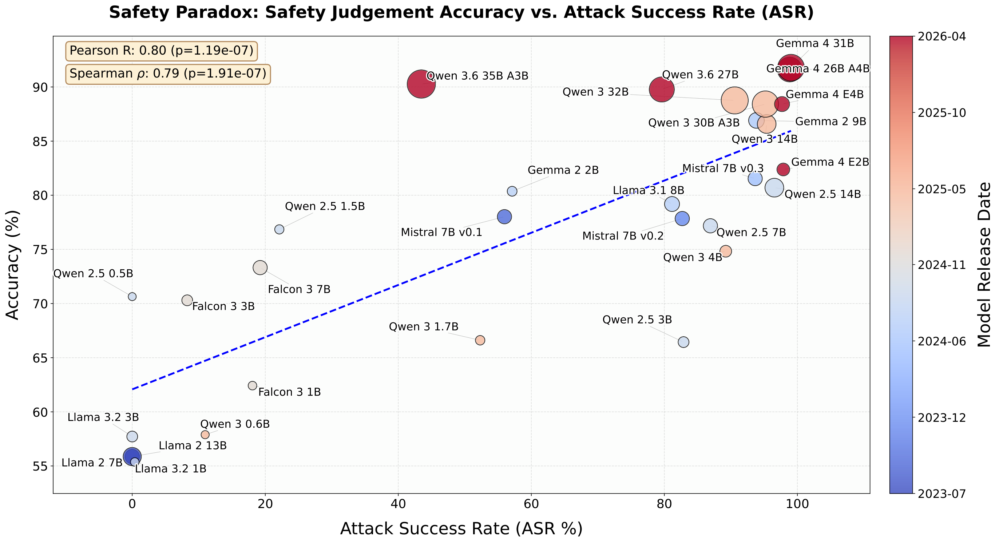

# Safety Paradox

Official code for **"Safety Paradox: How Enhanced Safety Awareness Leaves LLMs Vulnerable to Posterior Attack"**.

<p align="center">
  
</p>

Models trained to *judge* whether a generation is harmful can become *more* vulnerable to **Posterior Attack**—a jailbreak that inverts the judge prompt and asks the model to produce a harmful generation that would be classified as "Yes." This repository contains the training, evaluation used in the paper.


## Repository structure

```
├── train/                      # GRPO full fine-tuning (SAD.sh, SAI.sh)
├── Posterior_Attack/           # Posterior Attack generation + HarmBench ASR
├── Judgement_Ability/          # HarmBench-style classification accuracy
├── Utility_Eval/               # General utility: GSM8k + MMLU
├── Attack_FrontierLLMs/        # Posterior Attack on frontier models (API / local)
├── data/                       # Training data (wildguardtrain_4096.csv, etc.)
├── finetuned_models/grpo/      # Checkpoints: {model_short}/{dataset_name}/
├── run_full_pipeline.sh        # Train + evaluate (Posterior, Judgement, Utility)
├── run_eval_base.sh            # Base-model Posterior Attack + Judgement Ability
├── schedule_run_eval_base.sh   # Parallel base eval over models.sh (multi-GPU)
└── figures/                    # Paper figures
```

## Installation

**Requirements:** Python 3.10+, CUDA GPU(s), Hugging Face account for gated models (Llama, Gemma).

From the project root:

```bash
pip install -r requirements.txt
```

> **Note:** `requirements.txt` pins `vllm<0.20` for compatibility with common CUDA 12.x drivers. Some newer models (e.g. Qwen3.6, Gemma 4) may need a newer vLLM build—see comments in `run_eval_base.sh`.

## Quick start

To reproduce the safety-paradox figure

```bash
# Uses up to 4 GPUs by default; customize with NUM_GPUS and GPU_IDS
NUM_GPUS=4 GPU_IDS=0,1,2,3 bash schedule_run_eval_base.sh
```


## Training (GRPO)

Training uses **full-model GRPO** (no LoRA). Two dataset variants:

| Script | Reward | Purpose |
|--------|--------|---------|
| **SAI** | Classification-based | Main setup: improve safety judgement |
| **SAD** | Random 0/1 | Degradation baseline (no meaningful reward signal) |

Both use `data/wildguardtrain_4096.csv`. Checkpoints are saved to `finetuned_models/grpo/{model_short}/{dataset_name}/`.

```bash
# Default base models: SAD → Llama-3.1-8B-Instruct, SAI → Llama-3.1-8B-Instruct
bash train/SAI.sh meta-llama/Llama-3.1-8B-Instruct
bash train/SAD.sh meta-llama/Llama-3.1-8B-Instruct
```

Runs in order: (1) GRPO training, (2) Posterior Attack (Both), (3) Judgement Ability, (4) Utility (GSM8k + MMLU).

### Full pipeline (RL training + all evals)

```bash
bash run_full_pipeline.sh <model_name> [dataset_name]
# Examples:
bash run_full_pipeline.sh meta-llama/Llama-3.1-8B-Instruct SAD
bash run_full_pipeline.sh meta-llama/Llama-3.1-8B-Instruct SAI
```

or you can just simply run `bash run.sh`.

### Frontier LLM experiments

Posterior Attack against API and locally served frontier models (Claude, GPT, etc.) lives in `Attack_FrontierLLMs/`. See [`Attack_FrontierLLMs/README.md`](Attack_FrontierLLMs/README.md) for setup, API keys, and pre-computed results under `paper_results_*/`.

## Citation

If you use this code, please cite:

```bibtex
@misc{hoang2026safetyparadoxenhancedsafety,
      title={Safety Paradox: How Enhanced Safety Awareness Leaves LLMs Vulnerable to Posterior Attack}, 
      author={Long P. Hoang and Hai V. Le and Shaoyang Xu and Wei Lu and Wenxuan Zhang},
      year={2026},
      eprint={2606.05614},
      archivePrefix={arXiv},
      primaryClass={cs.AI},
      url={https://arxiv.org/abs/2606.05614}, 
}
```

